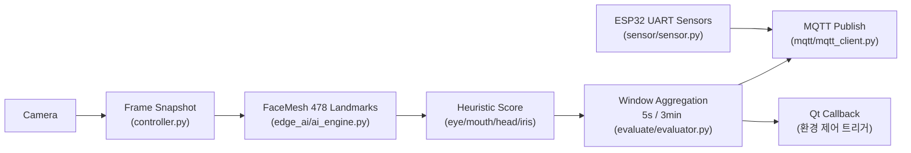

# ssafy-NaBang — Jetson 기반 실시간 집중도 측정 AIoT (FaceMesh + MQTT)

Jetson에서 **카메라 영상 → MediaPipe FaceMesh 랜드마크 추출 → 휴리스틱 기반 집중도 산출 → MQTT 전송**까지를 실시간으로 수행하는 **Edge(AIoT) 컨트롤러**입니다.  
Qt GUI에서 호출하기 쉽도록 `IoTController` 중심의 **함수/클래스 인터페이스 구조**로 구현했습니다.

- 내가 맡은 파트: `./controller`, `./test`
- 레포 내 문서 참고:
  - `README_p.md`: 프로젝트 기획/개요(플랫폼 관점)
  - `README_g.md`: GUI 관련 노트(가상키보드/X11 등)

---

## 맡은 파트 (Portfolio Focus)

> 담당 디렉토리: `./controller`, `./test`

### 1) Edge 컨트롤러 설계/구현 (`controller/`)
- `controller/controller.py`
  - `IoTController` 메인 루프 설계/구현(스냅샷 프레임 기반 단일 루프 처리)
  - 집중도 평가/누적 판단/전송/환경제어 트리거(콜백) 오케스트레이션
  - PCA9685(ServoKit) 기반 서보 제어 유틸 포함(`move_servo`)
- `controller/edge_ai/ai_engine.py`
  - MediaPipe FaceMesh(`refine_landmarks=True`) 기반 랜드마크(478) 추출
  - **학습 모델 대신 휴리스틱 스코어링**으로 7주 MVP 제약을 만족하도록 설계/구현
  - 눈/입/고개 회전/동공 중심성 기반 특징 추출 및 가중합 점수 산출
- `controller/evaluate/evaluator.py`
  - 5초(단기) / 3분(장기) 슬라이딩 윈도우 기반 평균·카운트 누적
  - 눈 감김/하품 프레임 카운트로 “집중 저하” 신호를 보강
- `controller/sensor/sensor.py`
  - ESP32(UART) 센서값(`CO2, NOISE, LIGHT, TEMP, HUMID`) 수신 스레드 + 이동평균 제공
- `controller/mqtt/mqtt_client.py`
  - mosquitto 기반 MQTT Pub/Sub 연동
  - TLS(8883) / Non-TLS(1883) 옵션 지원(현재 `controller.py`는 개발 편의상 `tls=False`로 호출)

### 2) MQTT 보안(TLS/ACL/자가서명) 테스트 (`test/mqtt/`)
- 사설 CA + 서버 인증서 생성 스크립트: `test/mqtt/generate_tls_certificate.py` (+ `openssl.cnf`)
- Mosquitto 설정 예시:
  - `test/mqtt/mosquitto.conf`: 1883(테스트용, 익명 접속)
  - `test/mqtt/mosquitto_tls.conf`: 8883(TLS)
  - `test/mqtt/mosquitto_tls_acl.conf`: 8883(TLS + password_file/acl_file)
- 파이썬 클라이언트 테스트:
  - `mqtt_without_tls.py` / `mqtt_with_tls.py` / `mqtt_with_tls_acl.py`

### 3) WebRTC 프로토타입 (부분 구현, 실서비스 미적용) (`controller/rtc`, `test/rtc`)
- 제한 요인(학습/적응 시간 + 포트 할당 제한 등)으로 **실서비스 적용은 보류**
- 레포에는 “동일 네트워크/로컬 환경에서 동작 확인 가능한 수준”의 코드가 포함
  - `test/rtc/server.py`, `test/rtc/client.py`: aiohttp + aiortc 최소 예제(서버는 `output.mp4`로 저장)
  - `test/rtc/server_janus.py`, `test/rtc/client_janus.py`: Janus(echotest) 연동 시도 코드
  - `controller/rtc/rtc_publisher.py`: 컨트롤러 내에서 publish 형태로 확장하기 위한 RTCPublisher

### 4) Jetson 현장 이슈 트러블슈팅(운영 안정성 기여)
- USB-UART 장치가 `/dev/ttyUSB*`로 잡히지 않는 이슈를 `dmesg` 기반으로 추적
  - 점자 드라이버(brltty)가 장치를 선점하는 문제
  - CH341 드라이버 구버전 이슈 등
- Wayland 환경에서 Qt 터치/가상키보드 overlay 문제가 있어 **X11 강제 구동**으로 안정화  
  - (`README_g.md` 참고)

---

## 왜 “휴리스틱 집중도” 구조인가?

원래는 집중도 예측 모델을 학습해 적용하려 했지만,

- 학습 데이터(라벨 포함) 확보 부족
- 7주라는 제한된 개발 기간
- Jetson에서의 실시간성/안정성 우선

이라는 제약 때문에, **학습 없이도 즉시 동작하고 디버깅/설명이 가능한 휴리스틱 구조**로 MVP를 완성했습니다.

---

## 시스템 흐름 (Architecture)



### 설계 포인트 1) “프레임 스냅샷”(안정성)
`controller/controller.py`에서 매 루프마다 `frame.copy()`로 스냅샷을 만들고, 해당 루프의 모든 연산(AI/평가/전송)을 **동일 프레임 기준**으로 수행합니다.

- `cv2.VideoCapture.read()`는 공유/동시 사용 시 결과가 흔들릴 수 있고(스레드 세이프 이슈)
- 캡처 파이프라인은 “읽기(read) 동작이 상태를 변화”시키는 경우도 있어  
→ **한 번 읽고 공유**하는 구조로 안정성을 우선했습니다.

### 설계 포인트 2) “MQTT”(경량/이식성)
Edge 디바이스는 CPU/메모리 여유가 제한되고 실시간 처리에 오버헤드가 민감합니다.  
그래서 HTTP 대비 메시지 오버헤드가 낮고 Pub/Sub에 적합한 **MQTT(mosquitto)** 를 채택했습니다.

또한 Jetson 외에도 Raspberry Pi 5 등으로 이식 가능성을 고려했을 때 MQTT는 운영/성능 측면에서 유리합니다.

---

## 구현 상세

### 1) AIEngine — FaceMesh 특징 추출 & 점수 산출 (`controller/edge_ai/ai_engine.py`)
**주요 특징(1~10 정규화 점수)**

- `Left/Right Eye Open`  
  - 눈 “내부 영역” 면적 / “눈두덩(outer outline)” 면적 비율로 눈 뜸 정도 추정
- `Mouth Closed`  
  - (입 벌어짐 거리) / (입 너비) 비율로 하품/입 벌림 추정 (inverse 정규화)
- `Head Rotation (LR)`  
  - 코 tip의 x 좌표가 화면 중앙(0.5)에서 얼마나 벗어났는지로 좌우 회전 추정(inverse 정규화)
- `Iris Centering`  
  - FaceMesh 좌표가 “이미지 전체 0~1 기준”이라 동공 변화가 매우 작게 잡히는 문제를 해결하기 위해  
    **얼굴 bbox 기준으로 재정규화 후**, 동공과 눈 중심의 거리로 중심성을 계산(inverse 정규화)

**가중합 + 페널티 기반 engagement score**
- 기본 가중치: 눈(0.35) / 입(0.175) / 고개좌우(0.275) / 동공(0.20)
- 페널티 예:
  - 눈 점수가 낮으면 동공 점수는 강하게 감점
  - 고개 회전이 크면 회전 점수 감점
  - 입 점수가 낮으면(하품/입 벌림) 점수 감점

### 2) Evaluator — 단기/장기 누적 판단 (`controller/evaluate/evaluator.py`)
- 단기: 5초 평균 (`engagement_average`)
- 장기: 3분 평균 (`engagement_long_average`)
- 장기 윈도우에서
  - 눈 감김 프레임(`eye_closed`)
  - 하품 프레임(`yawn`)
  카운트를 누적하여 집중 저하 신호로 활용

### 3) IoTController — 오케스트레이션 (`controller/controller.py`)
- 실행 순서(Qt에서 호출하는 흐름)
  1. `controller = IoTController(callback_from_ui=...)`
  2. `controller.set_mqtt(passwd)`  
     - `DEVICE_ID` 환경변수(디바이스 ID) + UI 입력 비밀번호로 MQTT 연결  
     - (현재 코드는 개발 편의상 `tls=False`; 실서비스는 TLS 권장)
  3. `controller.main_loop(target_time_sec)`  
     - `mqtt/{device_id}/decision`로 `"on"` 전송 후 루프 시작  
     - 5초마다 `mqtt/{device_id}/data`로 데이터 전송  
     - 5분마다 장기 평균/카운트 기준으로 `"control"` decision 전송 + `callback_from_ui(sensor_dict)` 호출

---

## MQTT 토픽/페이로드 규격

`controller/mqtt/mqtt_client.py` 기준

- Publish
  - `mqtt/{device_id}/data`
  - `mqtt/{device_id}/decision`
- Subscribe
  - `mqtt/{device_id}/command`

### data 예시
```json
{
  "device_id": "device123",
  "concentration": "6.42",
  "sensor": {
    "tmp": "24.10",
    "humidity": "41.20",
    "illuminance": "320.00",
    "co2": "650.00"
  },
  "pure_study_time": 12
}
```

### decision 예시
```json
{
  "device_id": "device123",
  "decision": "on",
  "target_time": 30
}
```

- `decision` 값
  - `"on"`: 스터디 시작
  - `"control"`: 집중 저하 감지 → 환경 제어 중(5분 주기)
  - `"off"`: 정상 종료/중단(현재는 구분 없이 off)

---

## 디렉토리 구조

```text
.
├─ controller/
│  ├─ controller.py
│  ├─ edge_ai/
│  │  └─ ai_engine.py
│  ├─ evaluate/
│  │  └─ evaluator.py
│  ├─ mqtt/
│  │  └─ mqtt_client.py
│  ├─ sensor/
│  │  └─ sensor.py
│  ├─ rtc/
│  │  ├─ mqtt_client.py
│  │  └─ rtc_publisher.py
│  └─ smartThings/
│     └─ .gitkeep
├─ test/
│  ├─ mqtt/
│  │  ├─ generate_tls_certificate.py
│  │  ├─ mosquitto.conf
│  │  ├─ mosquitto_tls.conf
│  │  ├─ mosquitto_tls_acl.conf
│  │  ├─ mqtt_without_tls.py
│  │  ├─ mqtt_with_tls.py
│  │  └─ mqtt_with_tls_acl.py
│  └─ rtc/
│     ├─ client.py
│     ├─ server.py
│     ├─ client_janus.py
│     └─ server_janus.py
├─ README_p.md
└─ README_g.md
```

---

## 실행 방법 (Jetson)

> ⚠️ Jetson 환경(I2C 서보, UART 센서)이 없으면 `ServoKit`/`SensorReader`에서 에러가 날 수 있습니다.  
> 테스트 목적이라면 해당 모듈을 임시 비활성화(주석 처리) 후 실행하세요.

### 1) 환경 변수
```bash
export DEVICE_ID="my_device_id"
```

### 2) 실행
```bash
python3 controller/controller.py
```

---

## 테스트 코드

### MQTT: 사설 인증서 생성
```bash
cd test/mqtt
python3 generate_tls_certificate.py
# ./certs/ 아래 ca.crt, server.crt, server.key 등이 생성됨
```

### Mosquitto TLS 설정 예시
- TLS만: `test/mqtt/mosquitto_tls.conf`
- TLS + ACL/Password: `test/mqtt/mosquitto_tls_acl.conf`  
  - `password_file etc/passwd`, `acl_file etc/acl` 경로는 환경에 맞게 준비 필요

### Python MQTT 클라이언트 테스트
```bash
cd test/mqtt
python3 mqtt_without_tls.py
python3 mqtt_with_tls.py
python3 mqtt_with_tls_acl.py
```

### WebRTC 최소 예제(로컬)
```bash
cd test/rtc
python3 server.py   # localhost:8080/offer
python3 client.py   # webcam -> server (output.mp4 기록)
```

### WebRTC + Janus(echotest) 연동 시도
- `server_janus.py`: Janus 세션/handle 생성 → echotest에 offer 전달 → polling으로 answer 반환(HTTPS 8443)
- `client_janus.py`: STUN 설정 + HTTPS 시그널링으로 offer 전송(자체 CA cert 사용)

> Janus 연동은 로컬 Janus 구성/포트/방화벽 환경이 필요하며, 현재 레포에는 “실서비스 미적용 상태의 프로토타입”으로 남아있습니다.

---

## Jetson 트러블슈팅 노트

### 1) USB-UART가 tty로 잡히지 않는 경우
- `dmesg`로 드라이버 선점/에러 확인
- 흔한 원인:
  - brltty(점자 드라이버)가 장치를 선점
  - CH341 드라이버 구버전 이슈
- 해결 방향:
  - brltty 비활성/제거(환경에 따라)
  - CH341 관련 커널 모듈 업데이트/교체(예: jetsonhacks 계열)

### 2) Wayland에서 Qt 터치/가상키보드 문제가 나는 경우
- X11로 강제 구동하여 회피 가능(README_g.md 참고):
```bash
QT_QPA_PLATFORM=xcb QT_IM_MODULE=qtvirtualkeyboard python3 main.py
```

---

## 한계 & 다음 단계
- 휴리스틱 기반은 “빠른 MVP”에 적합하지만 개인차/환경 변화(조명, 각도)에 대한 일반화 한계가 존재  
  → 데이터 수집/라벨링 파이프라인 구축 후 시계열 모델(LSTM 등)로 고도화 예정
- WebRTC는 네트워크/포트 제약으로 실서비스 적용 전 단계  
  → 배포 환경 확보 후 정식 통합 예정
